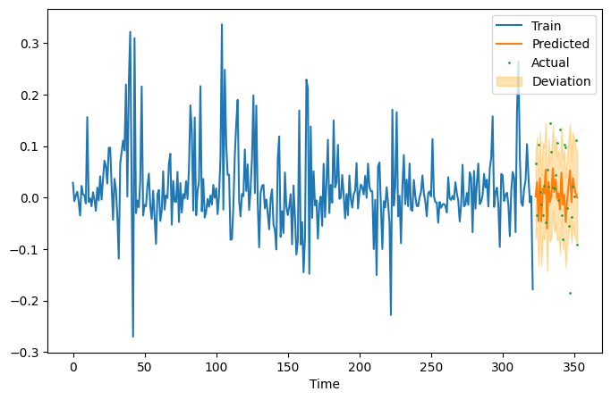

# forcastlib library
This is small a libarary mainly built for performing time series prediction tasks specifically for financial forecasting.

This library is built on top of the following probablistic programming languages:
* pyro [[1](#credits)] 
* some components of tensorflow-probability [[2](#credits)]
  
It supports full bayesian inference using variational inference for the following inference techniques:
* Simple bayesian regression
* Bayesian neural networks
* Gaussian processes
* Local and seasonal linear trends

It also contains two buit-in datasets for quick testing:
* EEG [[3](#credits)] 
* ethusd_tweets [[4](#credits)]

## Requirements
* tensorflow-cpu 2.11.0
* tensorflow-probability 0.18.0
* torch 1.13.0+cpu
* pyro-ppl 1.8.2
* graphviz
* matplotlib

## Installing Requirments on a Ubuntu based System
Use the `requirments.sh` script included in the project:
```bash
cd {repository_directory}
sudo ./requirments.sh
```
**Warning:** This is only tested on Ubuntu 22.04.
## Example Usage
The following code sipped shows time series prediction using simple bayesian regression:

```python
# get data
X, Y = tweets_data()

# train-test-split
X_train = torch.from_numpy(X[:-30]).float()
Y_train = torch.from_numpy(Y[:-30]).float()

X_test = torch.from_numpy(X[-30:]).float()
Y_test = torch.from_numpy(Y[-30:]).float()

# make model
model = BayesianRegression(len(X_train[0]), 1)

# training
model.fit(X_train, Y_train)

# predicting
mean, std = model.predict(X_test)
```
The following plot is obtained using `mean` and `std`:



See the jupyter nodetbooks startin with `demo-` prefix for example usage for each prediction technique.

## Credits
* [1] TensorFlow Distributions. Joshua V. Dillon, Ian Langmore, Dustin Tran, Eugene Brevdo, Srinivas Vasudevan, Dave Moore, Brian Patton, Alex Alemi, Matt Hoffman, Rif A. Saurous. arXiv preprint arXiv:1711.10604, 2017.
* [2] E. Bingham et al., “Pyro: Deep Universal Probabilistic Programming,” J. Mach. Learn. Res., vol. 20, p. 28:1-28:6, 2019, [Online]. Available: http://jmlr.org/papers/v20/18-403.html
* [3] http://archive.ics.uci.edu/ml/machine-learning-databases/00264/EEG%20Eye%20State.arff
* [4] Etherium prices dataset used by Alex Honchar in his medium article: https://alexrachnog.medium.com/financial-forecasting-with-probabilistic-programming-and-pyro-db68ab1a1dba

## License

This project uses libraries licensed under Apache License 2.0, hence include a copy of the licence in the LICENSE file. It complies with Apache License 2.0 to its extent. 
